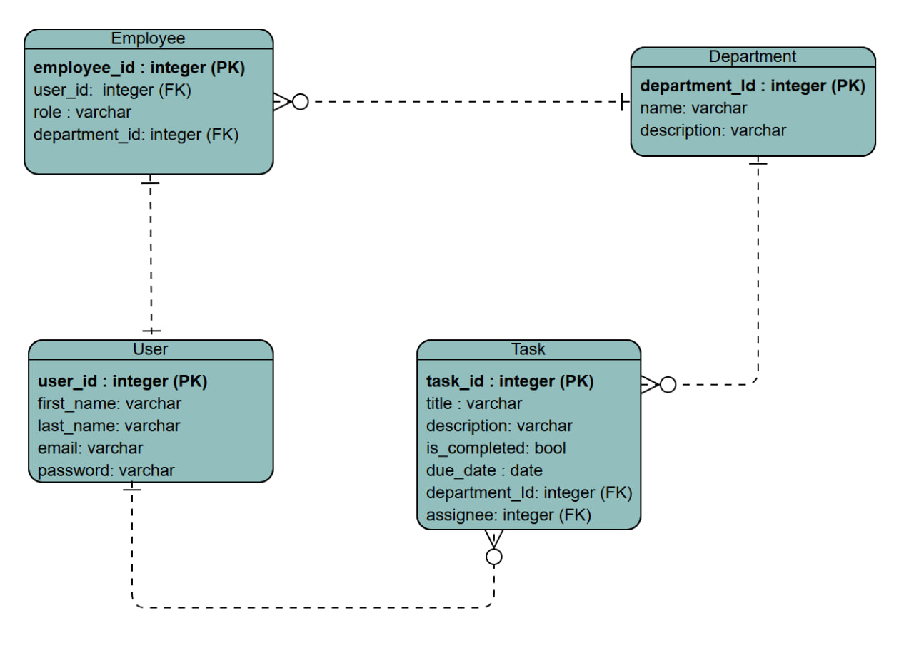

# ⚙️ Employee Management System - Backend

This repository contains the Django REST Framework (DRF) backend for the Employee Management System. 
It powers the frontend by providing a secure, role-based JSON API for all operations related to users, departments, and tasks.
The backend implements JWT authentication, custom user roles, and object-level permissions to ensure fine-grained access control.

**Frontend Repository:**   https://github.com/Deem02/capstone-project-frontend.git


## 🛠 Tech Stack


| Category           | Technology                       |
| ------------------ | -------------------------------- |
| **Framework/Language**      | Django, Python                        |
| **API Toolkit**    | Django REST Framework (DRF)      |
| **Authentication** | DRF Simple JWT (JSON Web Tokens) |
| **Database**       | PostgreSQL                       |
| **CORS Handling**  | django-cors-headers              |
| **API Testing**  |   Postman


<!-- ##  Features

*   **Custom User Model:** 
A one-to-one `Employee` profile model extends the built-in `User` to include custom roles (`ADMIN`, `USER`).
*   **JWT Authentication:** 
Secure token-based authentication with `access` and `refresh` tokens. 
*   **Role-Based API Permissions:**
    *   **Admin-Only Endpoints:** Custom `IsAdminRole` permission class restricts sensitive endpoints (like creating new employees) to admins.
    *   **Object-Level Permissions:** `IsAdminOrAssigneeForTask` permission allows a user to modify a task *only if* they are an admin or the task is assigned to them.
*   **Nested Serializers:** 
A single API endpoint (`/api/employees/`) handles the creation/update of *both* a `User` and their associated `Employee` profile in one atomic transaction.
*   **Secure, Scoped Queries:**
 Endpoints (like `/api/tasks/`) are filtered based on the user's role, ensuring a regular user can *only* ever see their own tasks. -->

## ERD (Entity Relationship Diagram)



## API Routing Table
| Path | Method | Description | Access |
|-----------|--------|-------------|--------|
| `api/login/` | POST | User login | Public |
| `api/employees/` | GET / POST | List or create employees | Admin |
| `/api/employees/:id/` | PUT / DELETE | Update or delete employee | Admin |
| `/api/departments/` | GET / POST | List or create departments | Admin |
| `/api/tasks/` | GET / POST | List or create tasks | Admin / Employee |
| `/api/tasks/:id/` | PUT / DELETE | Update or delete task | Admin / Assigned Employee |
| `/api/profile` | GET |Retrieve employee profile | Employee |

## ⚙️ Installation
1. Clone the repository:
```bash
git clone https://github.com/Deem02/capstone-project-backend.git
cd capstone-project-backend
```

2. Create and activate a virtual environment
```bash
python -m venv venv
venv\Scripts\activate # on Windows
source venv/bin/activate # On mac
```

3. Install dependencies
```bash
pip install -r requirements.txt
```

4.  Run migrations and start the development server
```bash
python manage.py migrate
python manage.py runserver
```
The API will be available at http://127.0.0.1:8000/api.

## Future Goals
- Email Notifications for new task assignments
- Task Due Date Reminders

